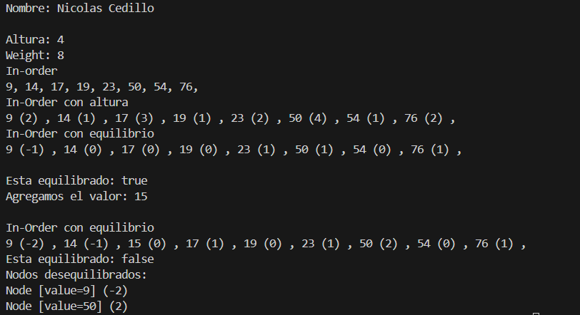

# Práctica de Atributos Arboles Binarios

## 📌 Información General

- **Título:** Práctica de Atributos Arboles Binarios
- **Asignatura:** Estructura de Datos
- **Carrera:** Computación
- **Estudiante:** Nicolás Cedillo
- **Fecha:** 19 de junio de 2025
- **Profesor:** Ing. Pablo Torres

---

## 🛠️ Descripción

En este proyecto se creo la clase ArbolBinario con los atributos:
- Node root;
- int peso;
- boolean equilibrado;
- List<Node> desequilibrados;

Y diferentes metodos para modificar y ver datos del Arbol

---
## Imagen

---

## 🚀 Ejecución

Para ejecutar el proyecto:

1. Compila el código:
    ```bash
    javac App.java
    ```
2. Ejecuta la aplicación:
    ```bash
    java App
    ```

---

## 🧑‍💻 Ejemplo de Entrada

```plaintext
Pre-Order
50, 17, 9, 14, 23, 19, 76, 54, 
Post-Order
14, 9, 19, 23, 17, 54, 76, 50,
Buscar 23
true
No encontro
Nombre: Nicolas Cedillo

Altura: 4
Weight: 8
In-order
9, 14, 17, 19, 23, 50, 54, 76,
In-Order con altura
9 (2) , 14 (1) , 17 (3) , 19 (1) , 23 (2) , 50 (4) , 54 (1) , 76 (2) , 
In-Order con equilibrio
9 (-1) , 14 (0) , 17 (0) , 19 (0) , 23 (1) , 50 (1) , 54 (0) , 76 (1) ,

Esta equilibrado: true
Agregamos el valor: 15

In-Order con equilibrio
9 (-2) , 14 (-1) , 15 (0) , 17 (1) , 19 (0) , 23 (1) , 50 (2) , 54 (0) , 76 (1) ,
Esta equilibrado: false
Nodos desequilibrados:
Node [value=9] (-2) 
Node [value=50] (2)
```

---

